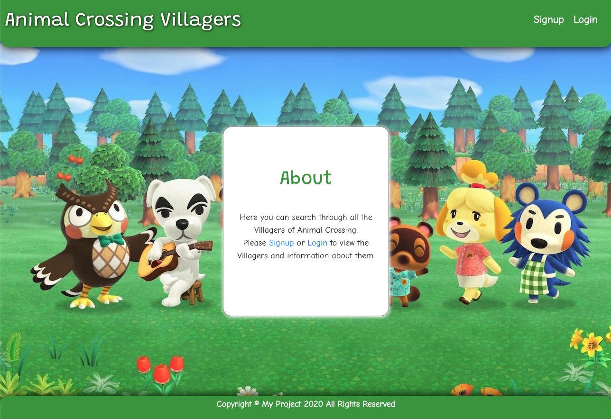
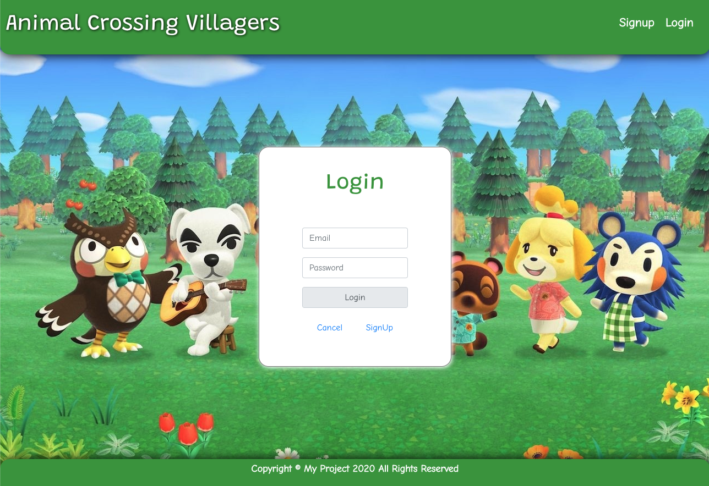
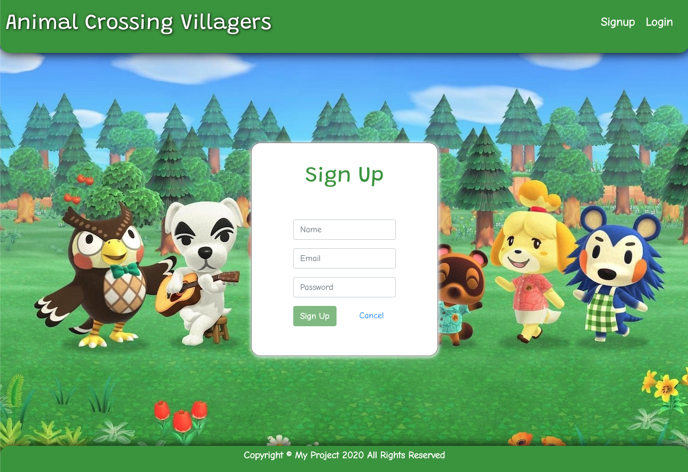
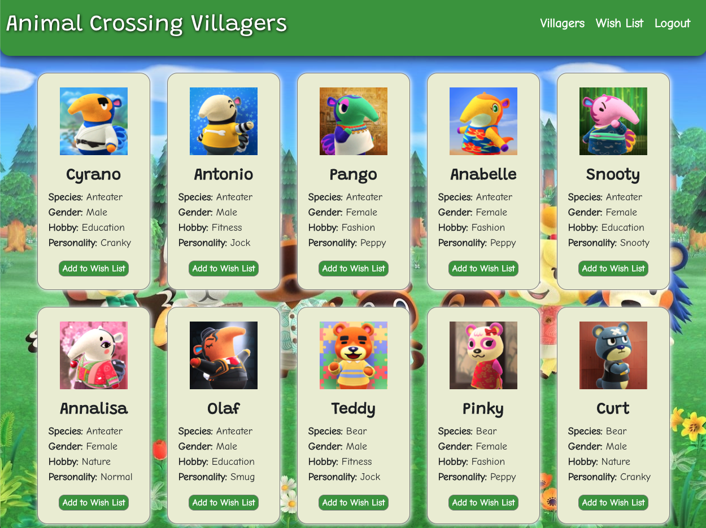
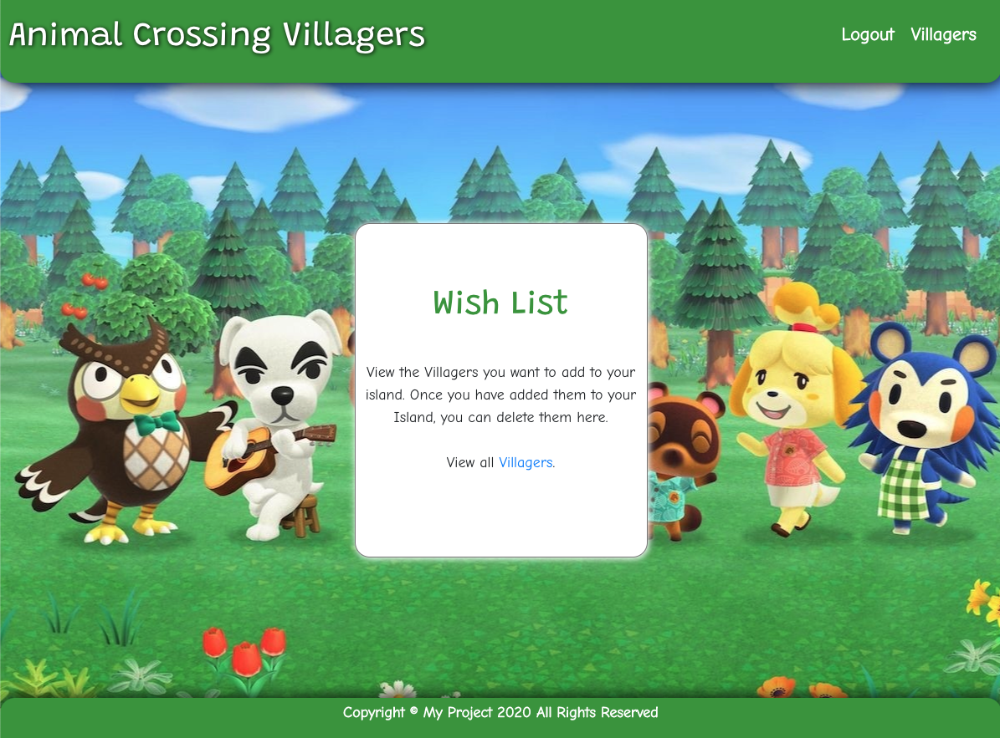

# Animal Crossing Villagers

## Introduction
A full-stack MERN, single-page application that allows a logged in user to view all Villagers from Animal Crossing.

## Technologies Used
- HTML5
- CSS3
- Express.js
- Node.js
- React.js
- Mongoose
- MongoDB
- Google Fonts
- Animal Crossing API

## WireFrames

## Screenshots

## Getting Started
- From the homepage you can either sign up or login.
- Once logged in you can view all Villagers from Animal Crossing

## Unsolved Problems
- Pagination

## Future Enhancements 
- Be able to add Villagers to your Wish List
- Be able to search Villagers by category
- Add Pagination to see only 50 Villagers at a time
- On the Wish List be able to delete Villagers you already added to your Island 